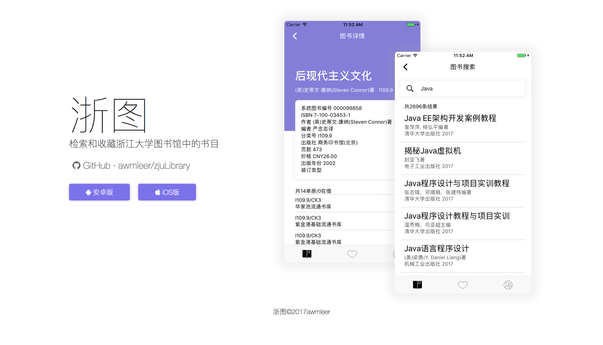

# 浙图

检索和收藏浙江大学图书馆中的书目。



👽欢迎提交PR和issue！

## 架构说明

这是一个基于ionic的hybrid app，无后端设计，所有的请求均为app直接请求浙大图书馆的API。

### 依赖

- ionic v3+
- cordova-plugin-inappbrowser
- cordova-sqlite-storage
- 其他详见`package.json`&`config.xml`

## 命令&脚本说明

### 环境配置

```bash
$ sudo npm install -g ionic cordova
$ npm install
$ ionic cordova plugin add xxx(具体的插件列表请看依赖)
```

### 开始开发

```bash
$ ionic serve
```

### 打包app

```bash
# Android
$ ionic cordova build android --release --prod
$ ./signApk.sh
# iOS
$ ionic cordova build ios --prod
```


## Commit Notation

- [+] add
- [-] remove
- [=] update
- [$] init
- [#] document
- [^] improve
- [~] refactor
- [!] fix
- [*] try


注：

由于*浙大图书馆*为商标，无法上架App Store，所以只能取名为*浙图*。
